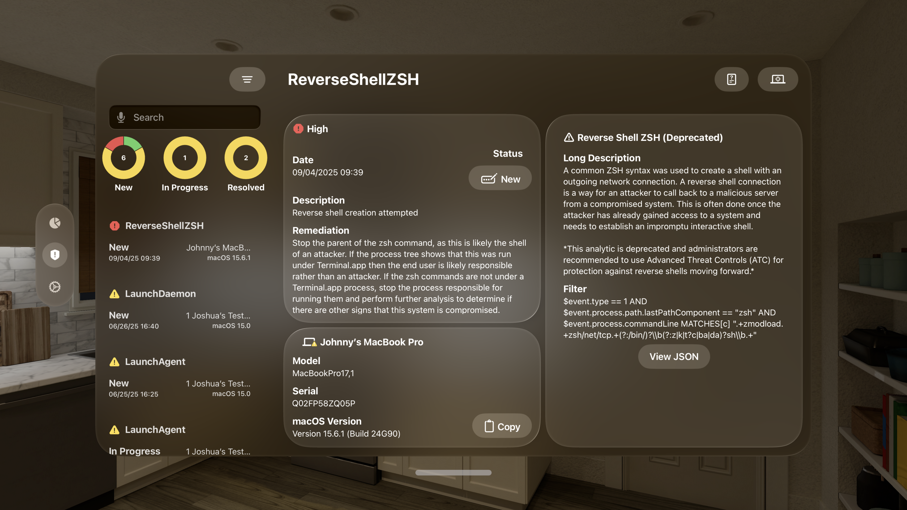
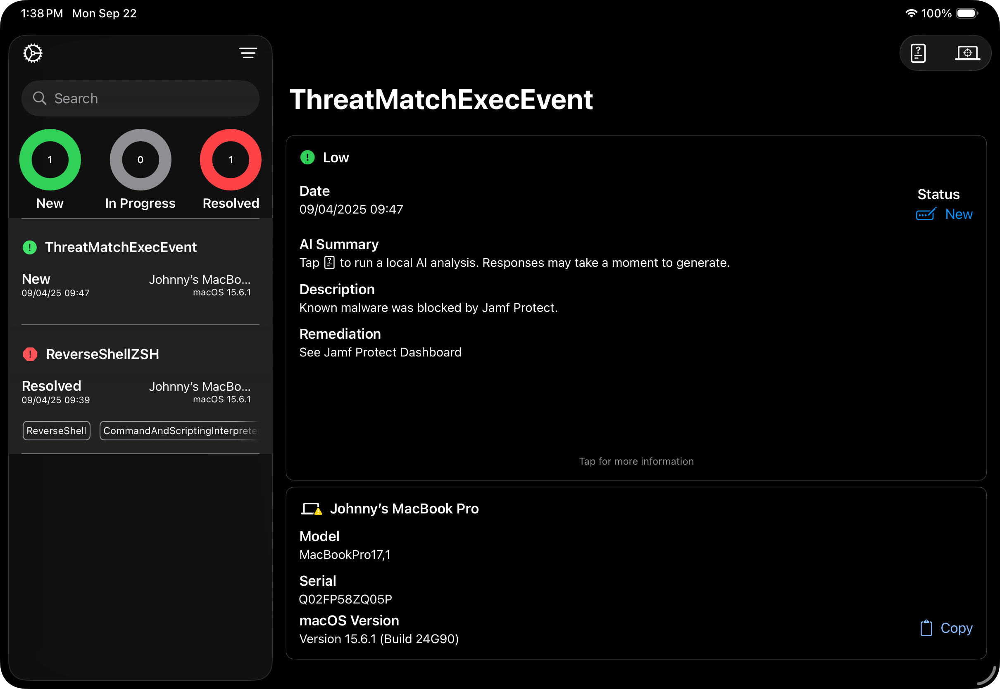
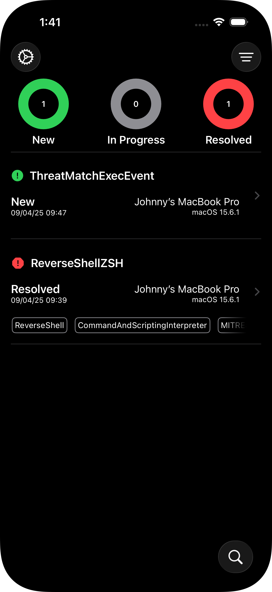
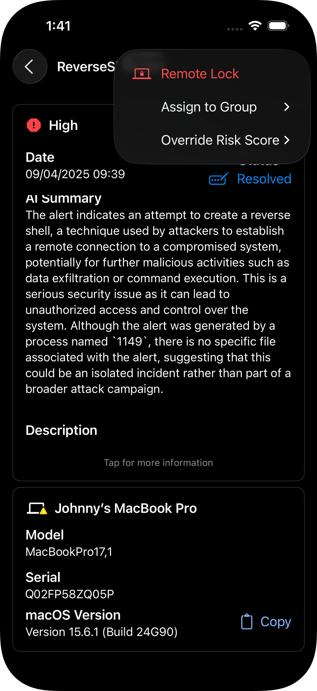

# remediaSOAR

Jamf Security Orchestration, Automation and Response on the go!

Available for download on [Apple's App Store](https://apps.apple.com/app/remediasoar/id6692309693).

&nbsp;

## Description

The remediaSOAR app gives administrators a streamlined way to view, filter, and flag macOS security alerts generated by Jamf Protect. You can review detailed data for each detection and take action through integrations with Jamf Pro and Jamf Security Cloud.

With the Jamf Pro integration, you can assign a device to a static computer group to scope a remediation policy, or send a Remote Lock command. 

With the Jamf Security Cloud integration, you can override a device’s risk score to restrict access to sensitive resources.

&nbsp;

## Terms of Use
The app and associated document are Copyright 2025, Jamf Software LLC and offered under the terms of the [Jamf Concepts Project Use Agreement](https://resources.jamf.com/documents/jamf-concept-projects-use-agreement.pdf).

&nbsp;

## Got Feedback? 
Please email us at "remediasoar" at jamf.com if you have suggestions. We'd love to hear your ideas! 

&nbsp;

## Requirements

Minimum Requirements: 

* Jamf Protect
* A device running one of the following:
  * iOS 26.0 or later
  * iPadOS 26.0 or later
  * visionOS 26.0 or later
  * macOS 26.0 or later

Optional Integrations:
* Jamf Pro
* Jamf Security Cloud

&nbsp;

## Setup Instructions

### Jamf Protect
Jamf Protect connection information is required to use the app. This integration allows you to review alerts, along with related analytics and computer details, and update the alert status.

*Step 1: Create an API Role*

* Navigate to Administrative > Account > Roles
* Create a new Role with the following permissions:
  * Computers: Read
  * Alerts: Write & Read
  * Analytics: Read

*Step 2: Create an API Client*

* Navigate to Administrative > API Clients
* Click "Create API Client"
* Enter a name for the access (eg. "Mobile Access")
* Assign the Role created in Step 1

### Jamf Pro (Optional)

The Jamf Pro integration allows you to assign a computer to a static computer group or send a Remote Lock command.

* Navigate to Settings > User Accounts and Groups
* Create a new User with a Custom Privilege Set
* Assign the following permissions: 
  * Jamf Pro Server Objects > Computers: Read & Update
  * Jamf Pro Server Objects > Static Computer Groups: Read & Update
  * Jamf Pro Server Actions > Send Computer Remote Lock Command
  * Jamf Pro Server Actions > Send MDM Check In Command
  * Jamf Pro Server Actions > View MDM command info in Jamf Pro API

### Jamf Security Cloud (Optional)

The Jamf Security Cloud integration allows you to assign or override a computer's risk score. 

* Navigate to Integrations > Risk API
* Select Generate API Key
* Enter a name for the key and save the credentials

&nbsp;

## Using the app

Once the settings have been configured, you can use the filter button to view security alerts by severity and date range. You can swipe left or right on alert items to resolve or flag them for followup. Tapping an alert item will display extended details. If you've configured the Jamf Pro or Security Cloud integrations, you can use the actions button in the upper-right to lock the device, add it to a static group to trigger a remediation workflow, or update the security cloud risk score to limit access to sensitive resources. 

&nbsp;

## Securing Your Secrets

Settings like server URLs, client and user IDs, and passwords are stored in your user keychain. If you enter them once and you use iCloud keychain sync, the information will already be available when you run the app on other devices using the same Apple ID.

&nbsp;

## Acknowledgments

remediaSOAR incorporates [SwiftyJSON](https://github.com/SwiftyJSON/SwiftyJSON) version 5.0.1, Copyright (c) 2017 Ruoyu Fu, 
under the project's [MIT License](https://github.com/SwiftyJSON/SwiftyJSON/blob/master/LICENSE). 

&nbsp;

## Screenshots

