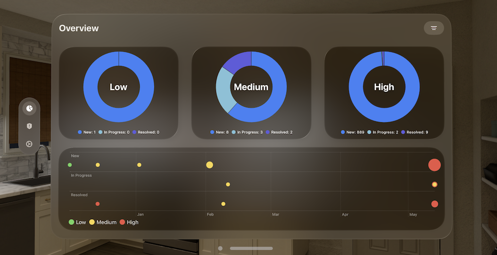
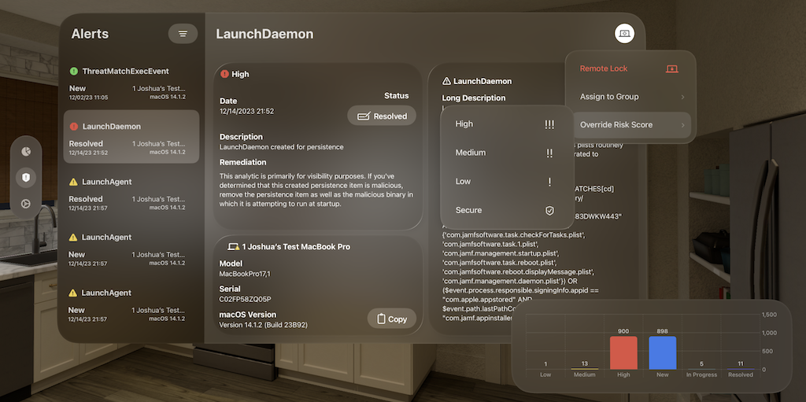
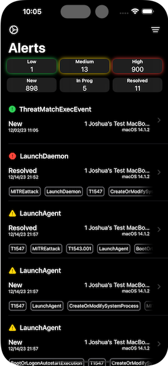
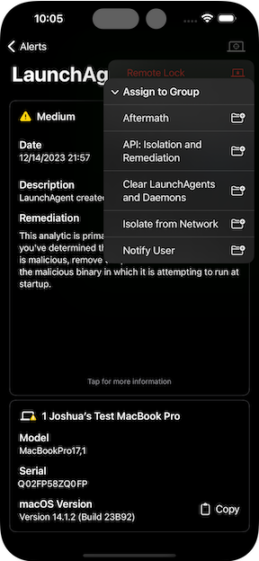

# remediaSOAR

Jamf Security Orchestration, Automation and Response on the go!

[Jamf Concepts Project Use Agreement](https://resources.jamf.com/documents/jamf-concept-projects-use-agreement.pdf)

## Description

remediaSOAR allows administrators to view, filter, and flag macOS security alerts generated by Jamf Endpoint Protection for Mac. You can read a detailed report about each detection and then remediate issues via integration with Jamf Pro and Jamf Security Cloud. 

For more information, please see remediaSOAR's listing on the Jamf Concepts website.

The Jamf Pro integration allows you to send a Remote Lock command to a Mac, or assign it to a Static Computer Group used to scope a remediation policy.

The Jamf Security Cloud integration allows you to override a device's Risk Score, blocking access to sensitive resources.

## Requirements

Minimum Requirements: 

* Jamf Protect
* A device running once of the following:
  * iOS/iPadOS 17.5 or greater
  * visionOS 1.1 or greater
  * macOS 14.4 or greater

The following additional integrations are optional:

* Jamf Pro
* Jamf Security Cloud

## Setup Instructions

### Jamf Protect
Jamf Protect connection information is required to use the application. This integration allows admins to review Alerts with their associated Analytics and Computer details, and update the Alert Status.

*Step 1: Create an API Role*

* Navigate to Administrative > Account > Roles
* Create a new Role with the following permissions
  * Computers: Read
  * Alerts: Write & Read
  * Analytics: Read

*Step 2: Create an API Client*

* Navigate to Administrative > API Clients
* Click "Create API Client"
* Type a name for the access (eg. "Mobile Access")
* Assign the Role created in step 1

### Jamf Pro

The optional Jamf Pro integration allows admins to assign a computer to a Static Computer Group and send a Remote Lock command.

* Navigate to Settings > User Accounts and Groups
* Create a new User with a Custom Privilege Set
* Enable only the following permissions: 
  * Jamf Pro Server Objects > Computers: Read & Update
  * Jamf Pro Server Objects > Static Computer Groups: Read & Update
  * Jamf Pro Server Actions > Send Computer Remote Lock Command
  * Jamf Pro Server Actions > Send MDM Check In Command
  * Jamf Pro Server Actions > View MDM command info in Jamf Pro API

### Jamf Security Cloud

The optional Jamf Security Cloud integration allows admins to assign or override the Risk Score for a computer. 

* Navigate to Integrations > Risk API
* Select Generate AP| Key
* Name the API key and save the credentials

## Security of Secrets at Rest

Server URLs, Client and User IDs, and Passwords are stored in Keychain.

## Bill of Materials and License

Please see the [Licence file](LICENSE.md) for more information

## How To Get Help
Please email "remediasoar" at jamf.com if you have questions or encounter a bug.

## Screenshots

 &nbsp;   &nbsp;   &nbsp;   
